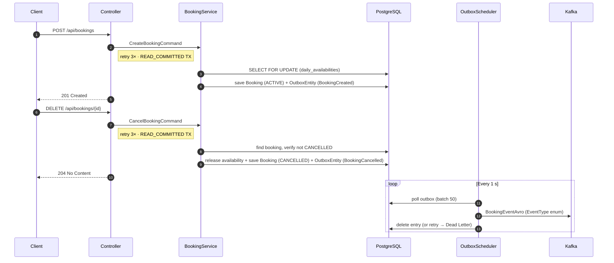
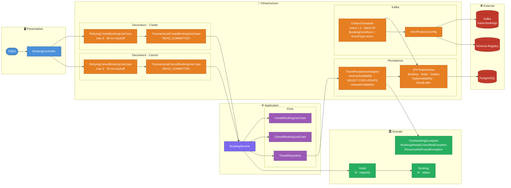

# ✈️ Travel Agency  -  Command Side (CQRS Write Model)

[](https://spring.io/projects/spring-boot)
[](https://openjdk.org/)
[](https://kafka.apache.org/)
[](https://www.postgresql.org/)
[](https://www.docker.com/)
[](https://grafana.com/)
[](https://prometheus.io/)
[](https://opentelemetry.io/)
[](https://github.com/mrzodeczko-dev/travel-agency-command-side/actions/workflows/ci.yml)
[](https://opensource.org/licenses/MIT)

<a id="overview"></a>
## 📖 Overview
[Back to Table of Contents](#toc)

Travel Agency Command Side is the write model of a CQRS-based hotel booking platform. It handles booking **creation** and **cancellation** commands  -  enforcing availability via **Pessimistic Locking** on a per-day availability table, and publishing events to Kafka via the **Transactional Outbox Pattern**. A single `BookingEventAvro` schema with an `EventType` enum (`BookingCreated` / `BookingCancelled`) is used for all booking events. Built on Hexagonal Architecture with a clean separation between domain, application, and infrastructure layers.

<a id="toc"></a>
## 📚 Table of Contents
- [📖 Overview](#overview)
- [🔄 How It Works](#how-it-works)
- [🌐 API Endpoints](#api-endpoints)
- [🚀 Getting Started](#getting-started)
- [⚙️ Environment Variables](#environment-variables)
- [🛠️ Common Issues](#common-issues)
- [🏗️ Architecture](#architecture)
- [💻 Tech Stack](#tech-stack)
- [🧪 Testing Strategy](#testing-strategy)
- [📡 Observability](#observability)
- [📂 Repository Structure](#repository-structure)
- [🤝 Contact](#contact)

---

<a id="how-it-works"></a>
## 🔄 How It Works
[Back to Table of Contents](#toc)

### Booking Creation

1. Client sends `POST /api/bookings` with hotel ID, user ID, and desired dates
2. `BookingController` maps the request to a `CreateBookingCommand` and delegates to `CreateBookingUseCase`
3. `RetryingCreateBookingUseCase` wraps the call with Spring Retry  -  up to 3 attempts with 50 ms backoff on `DataIntegrityViolationException`
4. `TransactionalCreateBookingUseCase` wraps the operation in a single DB transaction (`READ_COMMITTED`)
5. `BookingService` fetches the `Hotel` aggregate and calls `reserveAvailability` on the repository port
6. `TravelPersistenceAdapter` runs `SELECT ... FOR UPDATE` (pessimistic write lock) on all rows in `daily_availabilities` matching the hotel and date range  -  with a 3 s lock timeout
7. For each date in the range: if a row exists it is checked against capacity and incremented; if no row exists it is created at `occupiedRooms = 1`. `OverbookingException` is thrown on any date that is full
8. The new `Booking` (status `ACTIVE`) is persisted and an `OutboxEntity` record (type `BookingCreated`) is saved **in the same transaction** (Transactional Outbox Pattern)

### Booking Cancellation

1. Client sends `DELETE /api/bookings/{id}`
2. `BookingController` delegates to `CancelBookingUseCase`
3. `RetryingCancelBookingUseCase` wraps with Spring Retry (same policy as creation)
4. `TransactionalCancelBookingUseCase` wraps in a `READ_COMMITTED` transaction
5. `BookingService` loads the booking, verifies it is not already `CANCELLED` (throws `BookingAlreadyCancelledException` → `409`), releases availability for each day in the range, sets the booking status to `CANCELLED`, and saves a `BookingCancelled` outbox entry

### Outbox Publishing (shared)

1. `OutboxScheduler` polls the outbox table every second, serialises pending entries to `BookingEventAvro` (with `EventType` enum set to `BookingCreated` or `BookingCancelled`), and publishes them to the `travel.bookings` Kafka topic
2. On publish failure the entry's retry counter is incremented; after `max-retries` the message is moved to the **Dead Letter** table



---

<a id="api-endpoints"></a>
## 🌐 API Endpoints
[Back to Table of Contents](#toc)

**Base URL:** `http://localhost:8080`

### Hotel Endpoints

| Method | Path | Purpose | Request Body | Success | Common Errors |
|--------|------|---------|--------------|---------|---------------|
| `POST` | `/api/hotels` | Create a new hotel | `CreateHotelRequestDto` | `201 Created` | `400` |
| `PATCH` | `/api/hotels/{id}` | Update hotel capacity | `UpdateHotelCapacityRequestDto` | `200 OK` | `400`, `404` |

### Booking Endpoints

| Method | Path | Purpose | Request Body | Success | Common Errors |
|--------|------|---------|--------------|---------|---------------|
| `POST` | `/api/bookings` | Create a new booking | `CreateBookingRequestDto` | `201 Created` | `400`, `409` |
| `DELETE` | `/api/bookings/{id}` | Cancel a booking |  -  | `204 No Content` | `404`, `409` |

### Request Body  -  `CreateHotelRequestDto` / `UpdateHotelCapacityRequestDto`

| Field | Type | Constraints | Description |
|-------|------|-------------|-------------|
| `capacity` | `Long` | `@NotNull @Positive` | Number of rooms in the hotel |

### Request Body  -  `CreateBookingRequestDto`

| Field | Type | Constraints | Description |
|-------|------|-------------|-------------|
| `hotelId` | `Long` | `@NotNull` | ID of the hotel to book |
| `userId` | `Long` | `@NotNull` | ID of the user making the booking |
| `start` | `LocalDate` | `@NotNull @FutureOrPresent` | Check-in date |
| `end` | `LocalDate` | `@NotNull @FutureOrPresent` | Check-out date |

### Health & Documentation Endpoints

| Method | Path | Purpose | Success |
|--------|------|---------|---------| 
| `GET` | `/actuator/health` | Application health check | `200 OK` |
| `GET` | `/swagger-ui/index.html` | Swagger UI (requires `SPRINGDOC_ENABLED=true`) | `200 OK` |
| `GET` | `/v3/api-docs` | OpenAPI 3 spec (JSON) | `200 OK` |

### cURL Example

```bash
curl -X POST http://localhost:8080/api/bookings \
  -H "Content-Type: application/json" \
  -d '{
    "hotelId": 1,
    "userId": 42,
    "start": "2026-08-01",
    "end": "2026-08-07"
  }'
```

**Response `201 Created`:**
```json
{ "bookingId": 17 }
```

**Response `409 Conflict`** (hotel fully booked on any day in range):
```json
{
  "message": "Hotel 1 overbooked on 2026-08-03. Capacity: 2, occupied: 2"
}
```

**Response `409 Conflict`** (pessimistic lock timeout  -  concurrent request):
```json
{
  "message": "Resource is temporarily locked. Please retry."
}
```

### Cancel a Booking

```bash
curl -X DELETE http://localhost:8080/api/bookings/17
```

**Response `204 No Content`**  -  booking cancelled successfully.

**Response `409 Conflict`** (already cancelled):
```json
{
  "message": "Booking 17 is already cancelled"
}
```

---

<a id="getting-started"></a>
## 🚀 Getting Started
[Back to Table of Contents](#toc)

### Prerequisites

- Docker and Docker Compose v2+
- Java 25+ and Maven 3.9+ (for local builds only)
- Kafka broker reachable at `kafka:9092` (included in the Compose stack)
- Confluent Schema Registry reachable at `http://schema-registry:8200`

### Environment Configuration

Create a `.env` file in the project root (see [Environment Variables](#environment-variables) for all options):

```dotenv
# ─── PostgreSQL ───────────────────────────────────────────────────────────────
TA_COMMAND_SIDE_SERVICE_DB_PORT=5432
TA_COMMAND_SIDE_SERVICE_DB_NAME=travels_db
TA_COMMAND_SIDE_SERVICE_DB_USER=user
TA_COMMAND_SIDE_SERVICE_DB_PASSWORD=user1234
TA_COMMAND_SIDE_SERVICE_DB_ROOT_PASSWORD=root

# ─── Application ─────────────────────────────────────────────────────────────
TA_COMMAND_SIDE_SERVICE_PORT=8080
TA_COMMAND_SIDE_SERVICE_APPLICATION_NAME=travel-agency-command-side

# ─── Kafka ───────────────────────────────────────────────────────────────────
CLUSTER_ID=MkU3OEVBNTcwNTJENDM2Qk
KAFKA_BROKER_ID=1
KAFKA_ADVERTISED_LISTENERS=PLAINTEXT://kafka:9092
KAFKA_HEAP_OPTS=-Xmx512M -Xms512M

# ─── Topics ──────────────────────────────────────────────────────────────────
TOPIC_BOOKINGS=travel.bookings
TOPIC_HOTELS=travel.hotels
TOPIC_PARTITIONS=3
TOPIC_REPLICAS=1
```

### Start the Service

```bash
docker compose up -d --build
```

Verify: `curl http://localhost:8080/actuator/health` → `{"status":"UP"}`

---

<a id="environment-variables"></a>
## ⚙️ Environment Variables
[Back to Table of Contents](#toc)

### PostgreSQL

| Variable | Required | Description | Example |
|----------|----------|-------------|---------|
| `TA_COMMAND_SIDE_SERVICE_DB_PORT` | yes | Host port mapped to PostgreSQL | `5432` |
| `TA_COMMAND_SIDE_SERVICE_DB_NAME` | yes | Database name | `travels_db` |
| `TA_COMMAND_SIDE_SERVICE_DB_USER` | yes | Application DB user | `user` |
| `TA_COMMAND_SIDE_SERVICE_DB_PASSWORD` | yes | Application DB user password | `user1234` |
| `TA_COMMAND_SIDE_SERVICE_DB_ROOT_PASSWORD` | yes | PostgreSQL root password | `root` |

### Application

| Variable | Required | Description | Example |
|----------|----------|-------------|---------|
| `TA_COMMAND_SIDE_SERVICE_PORT` | yes | HTTP port the service listens on | `8080` |
| `TA_COMMAND_SIDE_SERVICE_APPLICATION_NAME` | optional | Spring application name | `travel-agency-command-side` |
| `SPRINGDOC_ENABLED` | optional | Enable Swagger UI and OpenAPI docs (default `false`) | `true` |

### Kafka

| Variable | Required | Description | Example |
|----------|----------|-------------|---------|
| `CLUSTER_ID` | yes | KRaft cluster ID | `MkU3OEVBNTcwNTJENDM2Qk` |
| `KAFKA_BROKER_ID` | yes | Broker ID | `1` |
| `KAFKA_ADVERTISED_LISTENERS` | yes | Advertised listener address | `PLAINTEXT://kafka:9092` |
| `KAFKA_HEAP_OPTS` | optional | JVM heap for Kafka broker | `-Xmx512M -Xms512M` |

### Topics

| Variable | Required | Description | Example |
|----------|----------|-------------|---------|
| `TOPIC_BOOKINGS` | yes | Kafka topic for booking events | `travel.bookings` |
| `TOPIC_HOTELS` | yes | Kafka topic for hotel events | `travel.hotels` |
| `TOPIC_PARTITIONS` | optional | Number of partitions for topic creation | `3` |
| `TOPIC_REPLICAS` | optional | Replication factor for topic creation | `1` |

### Observability

| Variable | Required | Description | Example |
|----------|----------|-------------|---------|
| `TRACING_ENABLED` | optional | Enable distributed tracing via OpenTelemetry (default `false`) | `true` |
| `TRACING_SAMPLING` | optional | Trace sampling probability 0.0–1.0 (default `1.0`) | `0.5` |

---

<a id="common-issues"></a>
## 🛠️ Common Issues
[Back to Table of Contents](#toc)

1. **Application fails to start  -  DB connection refused**  -  PostgreSQL healthcheck must pass before the app starts. Check with `docker compose ps travel-agency-command-side-postgres` and `docker compose logs travel-agency-command-side-postgres`. The app container waits on the healthcheck condition defined in `docker-compose.yml`.

2. **`OverbookingException` on every request**  -  the hotel's capacity in the DB may be 0 or the `daily_availabilities` table has stale data. Verify the `Hotel` record exists with `capacity > 0` and inspect the `daily_availabilities` rows for that hotel.

3. **`409  -  Resource is temporarily locked. Please retry.`**  -  a concurrent request is holding the pessimistic write lock on `daily_availabilities` for this hotel. The lock timeout is 3 seconds. Retry after a short delay; the other transaction will have committed or rolled back by then.

4. **Outbox messages stuck / not published**  -  check that Schema Registry is reachable at `http://schema-registry:8200`. Inspect `docker compose logs travel-agency-command-side` for Kafka producer errors. After `max-retries` (default 5) failures, messages are moved to the `dead_letter_outbox` table  -  query it directly to inspect the error messages.

5. **Port conflict**  -  check for conflicts on `5432` (PostgreSQL), `8080` (app), `9092` (Kafka), `8200` (Schema Registry), `8100` (Kafka UI), `9090` (Prometheus), `3000` (Grafana), `3200` (Tempo): `netstat -ano | findstr :8080`.

---

<a id="architecture"></a>
## 🏗️ Architecture
[Back to Table of Contents](#toc)



**Technical Highlights:**

- **Hexagonal Architecture (Ports & Adapters):** Domain and application layers have zero infrastructure dependencies. `TravelRepository` is the only bridge between application and infrastructure, implemented by `TravelPersistenceAdapter`.
- **CQRS Write Model:** This service handles only commands. All reads are delegated to a separate query-side service that consumes events from Kafka.
- **Decorator Chain:** Both create and cancel flows follow the same pattern: `Controller` → `Retrying*UseCase` (Spring Retry, 3 attempts, 50 ms backoff on `DataIntegrityViolationException`) → `Transactional*UseCase` (`READ_COMMITTED`) → `BookingService`. All decorators are wired in `BeansConfiguration`.
- **Pessimistic Locking on `daily_availabilities`:** Each row represents one hotel on one date. `reserveAvailability` issues `SELECT ... FOR UPDATE` on the affected rows with a 3 s lock timeout, preventing any concurrent transaction from double-booking the same day. New date slots are protected by a unique constraint `(hotel_id, date)` as an additional safety net for the first-booking race condition.
- **Transactional Outbox Pattern:** `Booking` and `OutboxEntity` are persisted in one DB transaction  -  guarantees at-least-once Kafka delivery even if the broker is temporarily unavailable.
- **Dead Letter Table:** Failed Kafka publishes are retried up to `max-retries` times; after that the record is moved to `dead_letter_outbox` for manual inspection and reprocessing.
- **Schema Management via Liquibase:** All DDL is managed through versioned XML changelogs under `db/changelog/changes/`. Hibernate runs with `ddl-auto: none`.
- **Virtual Threads + container-aware JVM:** `spring.threads.virtual.enabled=true` with `-XX:+UseContainerSupport -XX:MaxRAMPercentage=75.0 -XX:+UseG1GC`.
- **JDBC Batching:** Hibernate batch size 50 with `order_inserts=true` and `order_updates=true` for efficient bulk writes.

---

<a id="tech-stack"></a>
## 💻 Tech Stack
[Back to Table of Contents](#toc)

| Layer | Technology                                                                            |
|-------|---------------------------------------------------------------------------------------|
| Language | Java 25 (virtual threads via Project Loom)                                            |
| Framework | Spring Boot 4.0.6                                                                     |
| Web | Spring WebMVC, Spring Validation                                                      |
| Persistence | Spring Data JPA, Hibernate (batch writes, pessimistic locking)                        |
| Database | PostgreSQL 18                                                                         |
| Schema migrations | Liquibase                                                                             |
| Messaging | Apache Kafka (KRaft, no ZooKeeper)                                                    |
| Schema | Apache Avro 1.12.0, Confluent Schema Registry 8.2.0                                   |
| Serialisation | `kafka-avro-serializer`, `BookingEventAvro` + `EventType` enum generated from `.avsc` |
| Scheduling | Spring `@Scheduled` + ShedLock (OutboxScheduler  -  fixed delay 1 s)                    |
| Retry | Spring Retry (`RetryingCreateBookingUseCase`  -  3 attempts, 50 ms backoff)             |
| Build | Maven 3.9, multi-stage Docker build                                                   |
| Containerisation | Docker, Docker Compose v2+, non-root user, layer extraction                           |
| API docs | SpringDoc OpenAPI 3.0.3, Swagger UI (disabled by default)                              |
| Observability | Micrometer + Prometheus, OpenTelemetry tracing, Grafana dashboards, Tempo              |
| Utilities | Lombok                                                                                |

---

<a id="testing-strategy"></a>
## 🧪 Testing Strategy
[Back to Table of Contents](#toc)

Unit tests  -  plain JUnit 5, no Spring context loaded.

| Class | Key Scenarios |
|-------|--------------|
| `CreateBookingCommandTest` | Command construction, field constraints |
| `CancelBookingCommandTest` | Command construction, null validation |
| `BookingServiceTest` | Happy path creation, `OverbookingException`, `ResourceNotFoundException`, date validation |
| `BookingServiceCancelTest` | Cancel happy path, already cancelled → `BookingAlreadyCancelledException`, availability release |
| `OverbookingExceptionTest` | Exception message and construction |
| `BookingAlreadyCancelledExceptionTest` | Exception message and construction |
| `ResourceNotFoundExceptionTest` | Exception message and construction |
| `DailyAvailabilityTest` | `reserveOne()`, `releaseOne()`, boundary conditions |
| `HotelTest` | Domain model construction and behaviour |
| `CustomLocalDateSerializerTest` | Date serialisation to expected string format |
| `CustomLocalDateDeserializerTest` | Date deserialisation from string |
| `OutboxSchedulerTest` | Successful publish + delete, retry on failure, dead-letter promotion, unknown event type |
| `TravelPersistenceAdapterTest` | Adapter mappings and persistence calls |
| `OutboxEntityTest` | Entity construction, retry counter increment |
| `TravelMapperTest` | Mapping between domain models and JPA entities |
| `TransactionalCreateBookingUseCaseTest` | Transactional delegation to BookingService |
| `TransactionalCancelBookingUseCaseTest` | Transactional delegation for cancellation |
| `BookingControllerTest` | HTTP layer  -  201, 204, 400, 409 responses |
| `BookingControllerCancelTest` | DELETE endpoint  -  204, 409 responses |
| `ErrorResponseDtoTest` | DTO construction |
| `GlobalExceptionHandlerTest` | Exception → HTTP response mapping (including 409 for already cancelled) |

```bash
mvn test        # unit tests only
mvn verify      # unit tests + JaCoCo coverage report
```

---

<a id="observability"></a>
## 📡 Observability
[Back to Table of Contents](#toc)

The stack ships with a full observability pipeline  -  metrics, traces, and pre-built dashboards  -  all included in the Docker Compose setup and ready out of the box.

### Stack

| Component | Purpose | Default URL |
|-----------|---------|-------------|
| **Prometheus** | Metrics collection  -  scrapes `/actuator/prometheus` every 5 s | [http://localhost:9090](http://localhost:9090) |
| **Grafana** | Dashboards and visualization | [http://localhost:3000](http://localhost:3000) (admin / admin) |
| **Tempo** | Distributed tracing backend (OTLP receiver) | [http://localhost:3200](http://localhost:3200) |

### Grafana Dashboards

All dashboards are auto-provisioned into the **Travel Agency** folder on startup.

| Dashboard | Description | Direct Link |
|-----------|-------------|-------------|
| **Application General** | JVM metrics, HTTP request rates, latencies, error rates, HikariCP pool stats | [Open](http://localhost:3000/d/application-general) |
| **Booking Service** | `bookings_total`, `bookings_cancelled_total`, `bookings_failed_total`, create/cancel duration timers | [Open](http://localhost:3000/d/booking-service) |
| **Hotels Service** | `hotels_created_total`, `hotels_capacity_updated_total`, create/update duration timers | [Open](http://localhost:3000/d/hotels-service) |
| **Kafka Producer** | Producer throughput, batch sizes, request latencies, record send rate | [Open](http://localhost:3000/d/kafka-producer) |

### Custom Metrics

Business-level metrics exposed via Micrometer (`InstrumentedBookingService`, `InstrumentedHotelService`, `ObservabilityConfiguration`):

| Metric | Type | Description |
|--------|------|-------------|
| `bookings_total` | Counter | Total bookings created |
| `bookings_cancelled_total` | Counter | Total bookings cancelled |
| `bookings_failed_total` | Counter | Failed booking attempts (overbooking, not found, etc.) |
| `bookings_create_duration` | Timer | Time spent creating a booking |
| `bookings_cancel_duration` | Timer | Time spent cancelling a booking |
| `hotels_created_total` | Counter | Total hotels created |
| `hotels_capacity_updated_total` | Counter | Total hotel capacity updates |
| `hotels_create_failed_total` | Counter | Failed hotel creations |
| `hotels_update_failed` | Counter | Failed hotel capacity updates |
| `hotels_create_duration` | Timer | Time spent creating a hotel |
| `hotels_update_duration` | Timer | Time spent updating hotel capacity |
| `outbox_backlog` | Gauge | Pending outbox entries waiting to be published |
| `outbox_dead_letter_backlog` | Gauge | Entries in the dead letter table |

### Distributed Tracing

Tracing is powered by OpenTelemetry and disabled by default. Enable it with:

```dotenv
TRACING_ENABLED=true
TRACING_SAMPLING=1.0   # 0.0–1.0, default 1.0
```

Traces are exported via OTLP (HTTP) to Tempo and queryable in Grafana under the **Tempo** data source. The Tempo data source is pre-configured with trace-to-metrics correlation to Prometheus.

---

<a id="repository-structure"></a>
## 📂 Repository Structure
[Back to Table of Contents](#toc)

```text
.
├── src/
│   ├── main/
│   │   ├── avro/
│   │   │   └── BookingEvent.avsc                  # Avro schema → BookingEventAvro.java + EventType enum
│   │   ├── java/com/rzodeczko/
│   │   │   ├── application/
│   │   │   │   ├── command/
│   │   │   │   │   ├── CreateBookingCommand.java
│   │   │   │   │   └── CancelBookingCommand.java
│   │   │   │   ├── port/
│   │   │   │   │   ├── in/  CreateBookingUseCase · CancelBookingUseCase
│   │   │   │   │   └── out/ AvailabilityRepository · BookingRepository
│   │   │   │   │            HotelRepository · OutboxRepository
│   │   │   │   └── service/
│   │   │   │       └── BookingService.java
│   │   │   ├── domain/
│   │   │   │   ├── exception/
│   │   │   │   │   ├── OverbookingException.java
│   │   │   │   │   ├── BookingAlreadyCancelledException.java
│   │   │   │   │   └── ResourceNotFoundException.java
│   │   │   │   └── model/
│   │   │   │       ├── Booking.java
│   │   │   │       ├── BookingStatus.java         # ACTIVE, CANCELLED
│   │   │   │       ├── DailyAvailability.java
│   │   │   │       └── Hotel.java
│   │   │   ├── infrastructure/
│   │   │   │   ├── configuration/
│   │   │   │   │   ├── BeansConfiguration.java    # wires decorator chains (create + cancel)
│   │   │   │   │   ├── RetryConfiguration.java    # @EnableRetry
│   │   │   │   │   ├── SchedulingConfiguration.java
│   │   │   │   │   └── serializer/
│   │   │   │   │       ├── CustomLocalDateSerializer.java
│   │   │   │   │       └── CustomLocalDateDeserializer.java
│   │   │   │   ├── kafka/
│   │   │   │   │   ├── outbox/     OutboxScheduler.java
│   │   │   │   │   ├── producer/   AvroProducerConfig.java
│   │   │   │   │   └── properties/ KafkaTopicProperties · OutboxProperties
│   │   │   │   ├── persistence/
│   │   │   │   │   ├── adapter/    TravelPersistenceAdapter.java
│   │   │   │   │   ├── entity/     BookingEntity · HotelEntity · OutboxEntity
│   │   │   │   │   │               DailyAvailabilityEntity · DailyAvailabilityId
│   │   │   │   │   │               DeadLetterEntity
│   │   │   │   │   ├── mapper/     TravelMapper.java
│   │   │   │   │   └── repository/ JpaBookingRepository · JpaHotelRepository
│   │   │   │   │                   JpaOutboxRepository · JpaDailyAvailabilityRepository
│   │   │   │   │                   JpaDeadLetterRepository
│   │   │   │   └── tx/
│   │   │   │       ├── TransactionalRetryingOperator.java
│   │   │   │       └── usecase/
│   │   │   │           ├── TransactionalCreateBookingUseCase.java
│   │   │   │           ├── TransactionalRetryingCreateBookingUseCase.java
│   │   │   │           ├── TransactionalCancelBookingUseCase.java
│   │   │   │           └── RetryingCancelBookingUseCase.java
│   │   │   ├── presentation/
│   │   │   │   ├── controller/  BookingController.java
│   │   │   │   ├── dto/         CreateBookingRequestDto · CreateBookingResponseDto
│   │   │   │   │                ErrorResponseDto
│   │   │   │   └── exception/   GlobalExceptionHandler.java
│   │   │   └── TravelAgencyCommandSideApplication.java
│   │   └── resources/
│   │       ├── application.yaml
│   │       └── db/changelog/
│   │           ├── db.changelog-master.xml
│   │           └── changes/
│   │               ├── 001-create-sequences.xml
│   │               ├── 002-create-hotels.xml
│   │               ├── 003-create-bookings.xml
│   │               ├── 004-create-daily-availabilities.xml
│   │               ├── 005-create-outbox.xml
│   │               ├── 006-create-dead-letter-outbox.xml
│   │               ├── 007-create-shedlock.xml
│   │               └── 008-add-booking-status.xml
│   └── test/
│       └── java/com/rzodeczko/
│           ├── application/
│           │   ├── command/    CreateBookingCommandTest · CancelBookingCommandTest
│           │   └── service/    BookingServiceTest · BookingServiceCancelTest
│           ├── domain/
│           │   ├── exception/  OverbookingExceptionTest · ResourceNotFoundExceptionTest
│           │   │               BookingAlreadyCancelledExceptionTest
│           │   └── model/      HotelTest · DailyAvailabilityTest
│           ├── infrastructure/
│           │   ├── configuration/serializer/  CustomLocalDateSerializerTest
│           │   │                              CustomLocalDateDeserializerTest
│           │   ├── kafka/outbox/              OutboxSchedulerTest.java
│           │   ├── persistence/adapter/       TravelPersistenceAdapterTest.java
│           │   ├── persistence/entity/        OutboxEntityTest.java
│           │   ├── persistence/mapper/        TravelMapperTest.java
│           │   └── tx/                        TransactionalCreateBookingUseCaseTest
│           │                                  TransactionalCancelBookingUseCaseTest
│           └── presentation/
│               ├── controller/  BookingControllerTest · BookingControllerCancelTest
│               ├── dto/         ErrorResponseDtoTest.java
│               └── exception/   GlobalExceptionHandlerTest.java
├── .env                                           # environment variables
├── docker-compose.yml                             # PostgreSQL + Kafka KRaft + kafka-init + Schema Registry + Kafka UI + app
├── Dockerfile                                     # multi-stage build (maven → jre-alpine, non-root)
├── pom.xml
└── README.md
```

---

<a id="contact"></a>
## 🤝 Contact
[Back to Table of Contents](#toc)

Designed and implemented by **Michał Rzodeczko**.

GitHub: [mrzodeczko-dev](https://github.com/mrzodeczko-dev)
